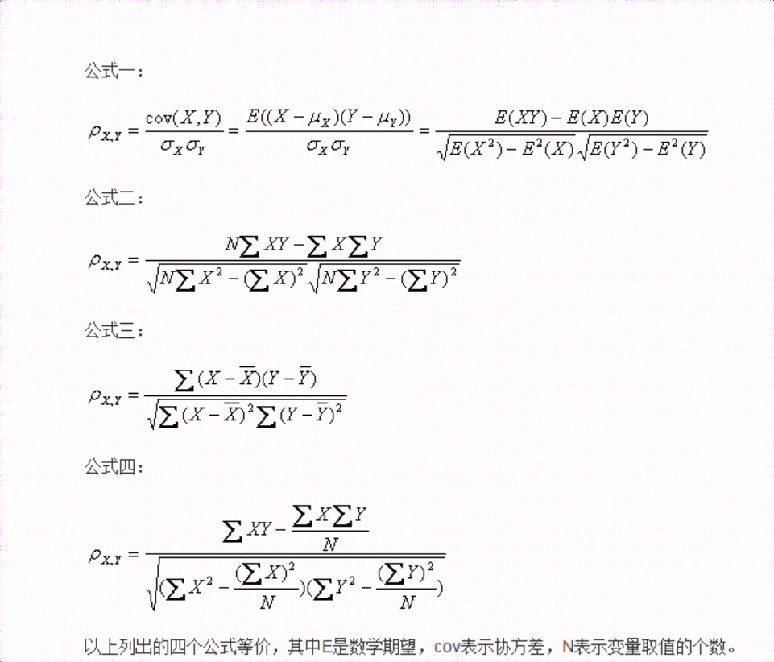
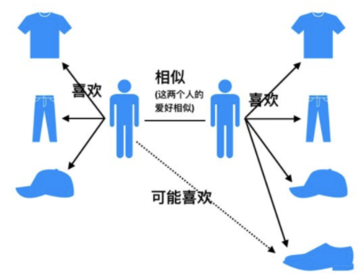
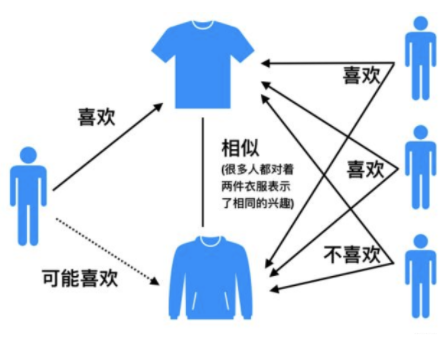
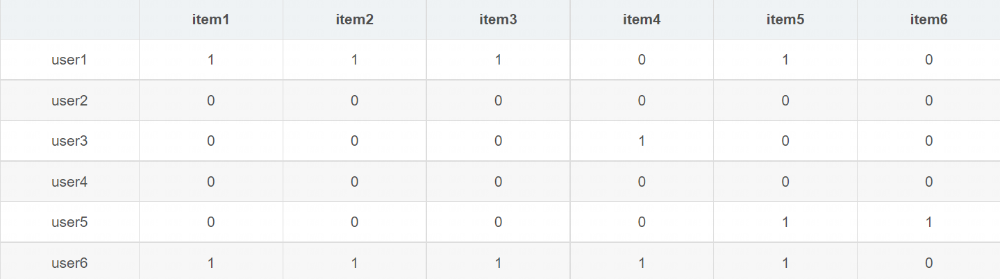
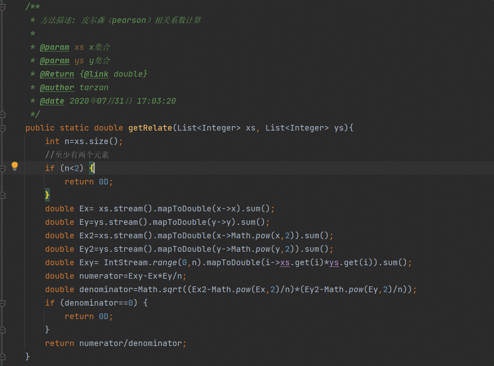
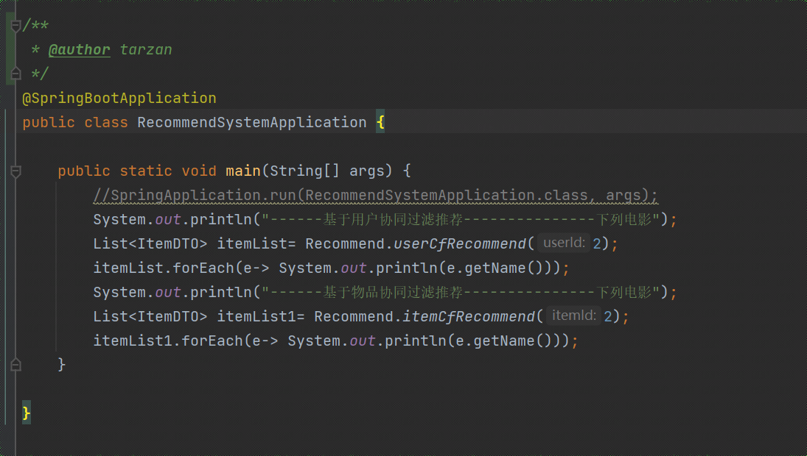

# JAVA推荐系统-基于用户和物品协同过滤的电影推荐

#### 系统原理
该系统使用java编写的基于用户的协同过滤算法（UserCF）和基于物品（此应用中指电影）的协同过滤(ItemtemCF）
利用统计学的相关系数经常皮尔森（pearson）相关系数计算相关系数来实现千人千面的推荐系统。

## 我的博客

1. **JAVA OPC UA专栏**：[https://blog.csdn.net/weixin_40986713/category_12356608.html](https://blog.csdn.net/weixin_40986713/category_12356608.html)
2. **AI绘画 | Stable diffusion**：[https://blog.csdn.net/weixin_40986713/category_12481790.html](https://blog.csdn.net/weixin_40986713/category_12481790.html) 
3. **java高级技术专栏**：[https://blog.csdn.net/weixin_40986713/category_10796066.html](https://blog.csdn.net/weixin_40986713/category_10796066.html)
4. **java Selenium自动化爬虫**：[https://blog.csdn.net/weixin_40986713/category_12165790.html](https://blog.csdn.net/weixin_40986713/category_12165790.html)
5. **java 推荐算法专栏**：[https://blog.csdn.net/weixin_40986713/category_12268014.html](https://blog.csdn.net/weixin_40986713/category_12268014.html)
6. **Java视频图像处理专栏**：[https://blog.csdn.net/weixin_40986713/category_11109931.html](https://blog.csdn.net/weixin_40986713/category_11109931.html) 
7. **AI大模型应用开发专栏** [https://blog.csdn.net/weixin_40986713/category_12735457.html](https://blog.csdn.net/weixin_40986713/category_12735457.html)

#### 协同过滤算法
协同过滤推荐算法是诞生最早，并且较为著名的推荐算法。主要的功能是预测和推荐。协同过滤(Collaborative Filtering,简写CF)是推荐系统最重要得思想之一，其思想是根据用户之前得喜好以及其他兴趣相近得用户得选择来给用户推荐物品(基于对用户历史行为数据的挖掘发现用户的喜好偏向，并预测用户可能喜好的产品进行推荐)，一般仅仅基于用户的行为数据（评价，购买，下载等），而不依赖于物品的任何附加信息（物品自身特征）或者用户的任何附加信息（年龄，性别等）。其思想总的来说就是：人以类聚，物以群分。
目前应用比较广泛的协同过滤算法是基于邻域的方法，而这种方法主要有两种算法：
分别是:

- 基于用户的协同过滤算法(user-based collaboratIve filtering 简称 UserCF)
给用户推荐和他兴趣相似的其他用户喜欢的产品
- 基于物品的协同过滤算法(item-based collaborative filtering 简称 ItemCF)
给用户推荐和他之前喜欢的物品相似的物品

#### 皮尔森(pearson)相关系数公式

公式定义为： 两个连续变量(X,Y)的pearson相关性系数(Px,y)等于它们之间的协方差cov(X,Y)除以它们各自标准差的乘积(σX,σY)。系数的取值总是在-1.0到1.0之间，接近0的变量被成为无相关性，接近1或者-1被称为具有强相关性。
 
 _皮尔森相关系数反映了两个变量的线性相关性的强弱程度，r的绝对值越大说明相关性越强。_ 

- 当r>0时，表明两个变量正相关，即一个变量值越大则另一个变量值也会越大；
- 当r<0时，表明两个变量负相关，即一个变量值越大则另一个变量值反而会越小；
- 当r=0时，表明两个变量不是线性相关的（注意只是非线性相关），但是可能存在其他方式的相关性（比如曲线方式）；
- 当r=1和-1时，意味着两个变量X和Y可以很好的由直线方程来描述，所有样本点都很好的落在一条直线上。

通常情况下通过以下取值范围判断变量的相关强度：
相关系数          0.8-1.0     极强相关
                 0.6-0.8     强相关
                 0.4-0.6     中等程度相关
                 0.2-0.4     弱相关
                 0.0-0.2     极弱相关或无相关

#### UserCF基于用户的协同过滤
 **算法思想** 

当一个用户A需要个性化推荐的时候，我们可以先找到和他有相似兴趣的其他用户，然后把那些用户喜欢的，而用户A没有听说过的物品推荐给A。

 **步骤** 

所有基于用户的协同过滤算法步骤为：

1. 找到和目标用户兴趣相似的其他用户集合
2. 找到这个集合中的用户喜欢的，且目标用户没有听说过的物品推荐给目标用户

 **缺点** 

1.数据稀疏性
一个大型的电子商务推荐系统一般有非常多的物品，用户可能买的其中不到1％的物品，不同用户之间购买的物品重叠性较低，导致算法无法找到一个用户的偏好相似的用户。这导致UserCF不适用与那些正反馈获取较困难的应用场景(如酒店预订，大件商品购买等低频应用)

2.用户相似度矩阵维护度大
UserCF需要维护用户相似度矩阵以便快速的找出Topn相似用户，该矩阵的存储开销非常大，存储空间随着用户数量的增加而增加，不适合用户数据量大的情况使用。

在互联网应用场景中，绝大多数产品的用户数都要远大于物品数，因此维护用户相似度矩阵的难度要大很多。

其适用于用户少，物品多，时效性较强的场合如新闻推荐场景。

#### ItemCF基于物品的协同过滤
 **算法思想** 

由于UserCF的缺陷，导致很多电商平台并没有采用这种算法，而是采用了ItemCF算法实现推荐系统。基于物品的协同过滤基本思想是预先根据所以用户的历史偏好数据计算物品之间的相似度，然后把与用户喜欢的物品相类似的物品推荐给用户。ItemCF算法并不利用物品的内容属性计算物品间的相似度，主要通过分析用户的行为记录计算物品之间的相似度。

 **步骤** 

基于物品的协同过滤算法步骤：

1.计算物品之间的相似度
2.根据物品的相似度和用户的历史行为给用户生成推荐列表（购买了该商品的用户也经常购买的其他商品）

 **缺点** 

1.数据稀疏性

表中数据0代表用户没有商品打分，1代表用户对商品打分了
想要计算物品相似度矩阵，则两个物品的向量需要满足至少同一行有2个1才能计算，即使有，如果行数过少，得出来得数据就不可靠。
因而ItemCF算法使用与电商平台等User数量远大于Item数量得应用场景

2.物品相似度矩阵维护难度大
对于有m个用户，n个物品，m>>n
则user相似度矩阵维度为：m*m
item相似度矩阵维度为:n*n
在user数量远远高于item数量时，维护item相似度矩阵要比user相似度矩阵容易。
所以ItemCF适用于兴趣变化较为稳定，更接近与个性化的推荐。适合物品少，用户多，用户兴趣固定持久，物品更新速度不是太快的场合。如推荐艺术品，音乐电影等.

#### UserCF和ItemCF的对比
|   | UserCF  |  ItemCF |
|---|---|---|
| 场景  | 适用于用户较少的场合，如果用户很多，计算用户相似度矩阵代价很大  |  适用于物品数量明显少于用户数的场合，如果物品很多，计算物品相似度矩阵难度很大 |
| 领域 | 时效性较强，用户个性化兴趣不太明显的领域，强调人与人之间的共性(微博热搜)  |  长尾物品(小众物品)丰富,用户个性化需求强烈的领域，强调人的个性 |
| 实时性  | 在用户有新行为，不一定造成推荐结果的立即变化  | 用户有新行为，一定会导致推荐结果的实时变化  |
|  冷启动 | 在新用户对很少的物品产生行为后，不能立即对他进行个性化推荐，因为用户相似度表是每隔一段时间离线计算的（只要用户有新行为，那么相似用户就很有可能发生变化，需要更新相似用户，才能做出准确的推荐）  | 新用户只要对一个物品产生行为，就可以给他推荐和该物品相关的其他物品  |
|  新物品 |  新物品上线一段时间后，一旦有用户对物品产生行为，就可以将新物品推荐给和对它产生行为的用户兴趣相似的其他用户 |   没有办法再不离线更新物品相似度表的情况下将新物品推荐给用户，因为新物品跟其他物品的相似度还没有计算，不能从相似性矩阵中找到对于的相似物品|
|  推荐理由|  很难提供令用户信服的推荐解释 |  利用用户的历史行为给用户做推荐解释，可以令用户比较信服 |

#### 代码实现

#### 软件架构
Spring boot单项目

#### 安装教程

1.  git下载源码
2.  maven构建依赖
3.  idea-java运行
#### 使用说明

1. 找到  src / main / java / com / tarzan / recommend / RecommendSystemApplication.java  右键java 运行

2.传入不同的用户id和不同的电影id，得到不同的推荐数据
            
            ------基于用户协同过滤推荐---------------下列电影
            Pulp Fiction (1994)
            While You Were Sleeping (1995)
            Four Weddings and a Funeral (1994)
            Remains of the Day, The (1993)
            Sleepless in Seattle (1993)
            Dances with Wolves (1990)
            Blues Brothers, The (1980)
            Sting, The (1973)
            Graduate, The (1967)
            Groundhog Day (1993)
            Back to the Future (1985)
            Young Frankenstein (1974)
            M*A*S*H (1970)
            When Harry Met Sally... (1989)
            Clueless (1995)
            Bridges of Madison County, The (1995)
            Muriel's Wedding (1994)
            Mrs. Doubtfire (1993)
            Ghost (1990)
            Harold and Maude (1971)
            Duck Soup (1933)
            Butch Cassidy and the Sundance Kid (1969)
            Annie Hall (1977)
            Manhattan (1979)
            Cool Hand Luke (1967)
            Great Dictator, The (1940)
            Somewhere in Time (1980)
            Being There (1979)
            Pretty Woman (1990)
            French Kiss (1995)
            Big Green, The (1995)
            ------基于物品协同过滤推荐---------------下列电影
            Guilty as Sin (1993)
            Colonel Chabert, Le (1994)

3.项目中用到的文件数据集ml-100k 在 src / main / resources目录下

#### 推荐阅读

[推荐算法专栏](https://blog.csdn.net/weixin_40986713/category_12268014.html?spm=1001.2014.3001.5482)

#### 常见问题

[点击查看](https://gitee.com/taisan/recommend_system/issues?assignee_id=&author_id=&branch=&collaborator_ids=&issue_search=&label_ids=&label_text=&milestone_id=&priority=&private_issue=&program_id=&project_id=taisan%2Frecommend_system&project_type=&scope=&single_label_id=&single_label_text=&sort=&state=closed&target_project=)

